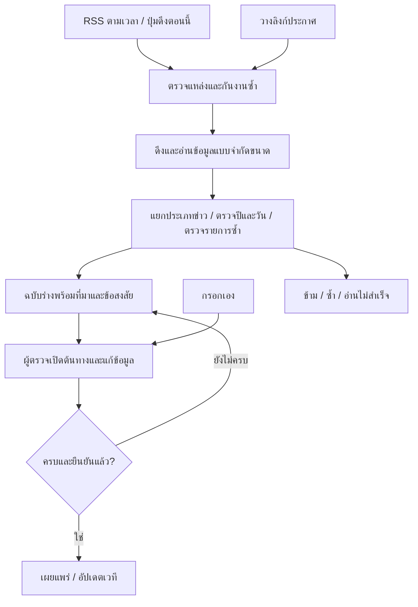

# งานต่อไปก่อนเปิดใช้งาน ChampionWays เต็มรูปแบบ

อัปเดต: 13 กันยายน 2569

## สถานะปัจจุบัน

- นำการแข่งขัน demo 14 รายการและเมนเทอร์ demo 6 คนออกจาก Production แล้ว เก็บบัญชีผู้ใช้และใบสมัครเดิมไว้
- แก้ข้อความ demo ที่ล้าสมัยบน Production แล้ว และซ่อนส่วนแนะนำเมื่อไม่มีข้อมูล
- **เส้นทาง "อยากแข่งงานไหน" ทำเสร็จแล้วบนเครื่องพัฒนา** เลือกเวที → ดูเมนเทอร์ที่ว่าง → ขอจอง 60 นาที
  → เมนเทอร์รับ → คุยในแชตของเว็บ รายละเอียดทั้งหมดอยู่ใน [journey.md](journey.md)
- หน้าเลือกเมนเทอร์แบบเดิมและการนัดคอลภายนอกถูกเอาออกแล้ว ทางเข้าสมัครเมนเทอร์ย้ายไปหน้า `/profile`
- ใบสมัครเมนเทอร์บันทึกข้อมูลได้ แต่ไฟล์ที่เลือกยังบันทึกเพียงชื่อไฟล์
- ระบบแชตกลุ่มอยู่บน `dev` ยังไม่ขึ้น Production เจ้าของกลุ่มเป็นผู้เชิญและนำสมาชิกออกได้เพียงคนเดียว
- พักงานระบบชำระเงินไว้ตามที่ตกลงกับเจ้าของโปรเจกต์
- **ต้องรัน migration `0002` กับฐานของ Preview และ Production ก่อนปล่อยใช้งาน**

## 1. เติมข้อมูลจริง

- [ ] เพิ่มการแข่งขันจริง พร้อมลิงก์ประกาศต้นทาง วันรับสมัคร คุณสมบัติ และข้อมูลที่ตรวจสอบแล้ว
- [ ] ตรวจใบสมัครที่ยังอยู่ในระบบ แยกใบสมัคร demo ออกจากใบสมัครจริงก่อนพิจารณาเผยแพร่
- [ ] รับเมนเทอร์จริงชุดแรก ตรวจตัวตน ประสบการณ์ และหลักฐาน
- [ ] เชื่อมโปรไฟล์เมนเทอร์ที่เผยแพร่กับบัญชีผู้สมัคร เพื่อรับคำขอคุยได้

**เกณฑ์ตรวจรับ:** หน้าสาธารณะแสดงเฉพาะข้อมูลจริงที่ตรวจแล้ว ลิงก์ต้นทางเปิดได้ และเมนเทอร์เข้าถึงคำขอที่ส่งถึงตนเองได้ ไม่สร้างอันดับความนิยมโดยไม่มีสถิติรองรับ

## 2. ทำใบสมัครเมนเทอร์ให้ครบวงจร — งานพัฒนาที่แนะนำให้เริ่มก่อน

- [ ] อัปโหลดรูปโปรไฟล์และหลักฐานจริง แยกไฟล์สาธารณะกับหลักฐานส่วนตัว
- [ ] ตรวจประเภทและขนาดไฟล์ พร้อมแสดงผลอัปโหลดและข้อผิดพลาดให้ผู้สมัครเข้าใจ
- [ ] ให้ผู้ตรวจที่มีสิทธิ์เปิดหลักฐานได้ และกันบุคคลอื่นเข้าถึง
- [ ] ตรวจการส่งอีเมลจริง ทั้งผลอนุมัติ ไม่อนุมัติ และขอข้อมูลเพิ่มเติม รวมกรณีส่งไม่สำเร็จ
- [ ] เพิ่มหน้าให้ผู้สมัครตรวจสถานะ อ่านเหตุผล และส่งข้อมูลเพิ่มเติมได้
- [ ] ปรับข้อความเกี่ยวกับไฟล์และการแจ้งผลให้ตรงกับความสามารถที่ทำเสร็จแล้ว

**เกณฑ์ตรวจรับ:** ผู้สมัครส่งข้อมูลและไฟล์ → ผู้ตรวจเปิดหลักฐาน → แจ้งผล → ผู้สมัครเห็นสถานะและแก้ไขตามคำขอได้ครบ ทดสอบด้วยบัญชีคนละบทบาท และไม่มีหลักฐานส่วนตัวหลุดผ่านลิงก์สาธารณะ

## 3. ทำระบบคิวและการจองจริง — ทำแล้ว เหลือทดลองกับคนจริง

- [x] กำหนดเวลาว่างและระยะเวลาปรึกษาของเมนเทอร์ โดยระบุเขตเวลาให้ชัด
- [x] ตรวจและป้องกันคิวทับซ้อนที่เซิร์ฟเวอร์ รวมกรณีหลายทีมจองพร้อมกัน
- [ ] กำหนดขั้นตอนส่งคำขอ รับคำขอ และยืนยันนัด
- [ ] รองรับการเลื่อนนัดและยกเลิก พร้อมแจ้งผู้เกี่ยวข้อง
- [ ] แสดงรายละเอียดนัดและลิงก์ Meet/Zoom ในกลุ่มที่เกี่ยวข้อง
- [ ] แยกสถานะนัดหมายจากสถานะการชำระเงินที่จะพัฒนาในภายหลัง

**เกณฑ์ตรวจรับ:** ไม่มีการยืนยันคิวซ้อน ผู้ใช้เห็นเวลาและสถานะตรงกันหลังรีเฟรช และการเลื่อนหรือยกเลิกเปลี่ยนสถานะครบทุกหน้าที่เกี่ยวข้อง

## 4. ทดลองแชตกับคนจริงก่อนนำขึ้น Production

- [ ] ทดลองร่วมกันด้วยเจ้าของทีม เมนเทอร์ และสมาชิกทีม
- [ ] ทดสอบรับคำขอ เชิญสมาชิก รับคำเชิญ ส่งข้อความ แนบไฟล์ และสถานะอ่าน
- [ ] ยืนยันว่าเฉพาะเจ้าของกลุ่มเพิ่มหรือนำสมาชิกออกได้ และผู้ถูกนำออกเปิดข้อความหรือไฟล์ต่อไม่ได้
- [ ] ทดลองมือถือ การกลับเข้าหน้าเดิม และการเชื่อมต่อขาดช่วง
- [ ] ตรวจการเปิดลิงก์ Meet/Zoom จากทุกบทบาท
- [ ] ประเมินภาระ polling และพื้นที่เก็บไฟล์ก่อนเพิ่มผู้ใช้งาน
- [ ] เตรียม migration ตารางแชตและตรวจค่าของ Production ก่อนปล่อยใช้งาน

**เกณฑ์ตรวจรับ:** เส้นทางคุยกับเมนเทอร์ใช้งานได้ครบด้วยบัญชีจริง ทดสอบสิทธิ์ผ่าน และมีผลตรวจหลัง deploy ทั้ง API และหน้าเว็บ

รายละเอียดระบบปัจจุบัน: [chat.md](chat.md)

## 5. เตรียมการดูแลผู้ใช้และระบบ

- [ ] เพิ่มช่องทางติดต่อและแจ้งปัญหาที่ทีมงานรับเรื่องได้จริง
- [ ] จัดทำหน้าเงื่อนไขบริการและความเป็นส่วนตัวให้ตรงกับข้อมูลและบริการที่ใช้งานจริง
- [ ] กำหนดวิธีรับเรื่องกรณีเมนเทอร์ไม่มาตามนัดหรือมีข้อร้องเรียน
- [ ] ติดตามข้อผิดพลาดของ API การอัปโหลด และการส่งอีเมล
- [ ] ตรวจการสำรองข้อมูลและทดลองขั้นตอนกู้คืน
- [ ] ตรวจเส้นทางสำคัญบนมือถือ คีย์บอร์ด และการเข้าถึงก่อนเปิดใช้งาน

**เกณฑ์ตรวจรับ:** ผู้ใช้รู้ว่าจะติดต่อใครเมื่อมีปัญหา ทีมงานติดตามเรื่องได้ และมีวิธีกู้คืนหรือรับมือเมื่อระบบขัดข้อง

## งานที่พักไว้

- ระบบชำระเงิน คืนเงิน และจ่ายเงินให้เมนเทอร์
- การสร้างห้อง Meet/Zoom ผ่าน API อัตโนมัติ ปัจจุบันใช้ลิงก์ที่ใส่เอง

ก่อนเริ่มระบบชำระเงิน ต้องตกลงผู้ให้บริการ รูปแบบรับและจ่ายเงิน ค่าบริการ เงื่อนไขยกเลิกและคืนเงิน แล้วพัฒนาใน Test mode ก่อน

## ลำดับดำเนินการ

เริ่มพัฒนาข้อ 2 พร้อมรวบรวมข้อมูลจริงในข้อ 1 จากนั้นทำข้อ 3 และทดลองข้อ 4 ให้ครบ เตรียมข้อ 5 ก่อนเปิดให้ผู้ใช้ทั่วไปใช้งานเต็มรูปแบบ โดยยังไม่เริ่มงานรับชำระเงินจริง

## 6. ออกแบบระบบนำเข้าข้อมูลการแข่งขันและ Cron

สถานะ: แผนสำหรับพัฒนาต่อ ยังไม่ได้เปิด Cron หรือเผยแพร่ข้อมูลจากแหล่งเหล่านี้อัตโนมัติ ตรวจแหล่งข้อมูลเมื่อ 13 กันยายน 2569 รายละเอียดผลทดสอบอยู่ใน [DATA-SOURCES.md](DATA-SOURCES.md)

### 6.1 เป้าหมายและวิธีเพิ่มข้อมูล

ให้ทีมงานเพิ่มข้อมูลได้สามทาง โดยใช้แบบฟอร์มตรวจทานชุดเดียวกัน:

1. **เขียนเอง:** ใช้หน้า `/admin/listings` ที่มีอยู่แล้ว เพิ่มและแก้การแข่งขันพร้อมลิงก์ต้นทาง
2. **วางลิงก์:** เพิ่มปุ่ม “นำเข้าจากลิงก์” ระบบอ่านประกาศและสร้างร่าง ทีมงานเติมข้อมูลที่ขาด
3. **ดึงตามเวลา:** Cron อ่านแหล่งข่าวที่เปิดใช้งาน แล้วสร้างรายการรอตรวจ มีปุ่ม “ดึงตอนนี้” ให้เรียกด้วยมือได้ด้วย

ข้อมูลที่ดึงมาจะไม่เข้า `competitions` จนกว่าผู้ตรวจจะกดเผยแพร่ การดึงครั้งถัดไปต้องไม่เขียนทับข้อความที่ผู้ตรวจแก้เอง



### 6.2 แหล่งข้อมูลและลำดับเชื่อมต่อ

| แหล่ง | URL เริ่มต้น | วิธีดึง | ข้อจำกัด |
|---|---|---|---|
| YSC / สวทช. | https://www.nstda.or.th/ysc/feed/ | RSS → หน้าประกาศที่เกี่ยวข้อง | พบ 10 items ต้องแยกรับสมัครกับผลการแข่งขัน และติดตามหน้าเดิมที่เปลี่ยนปี |
| NECTEC | https://www.nectec.or.th/feed/ | RSS → ข่าวการแข่งขัน | พบ 10 items มีข่าวองค์กรปน ต้องกรองก่อนเข้าคิว |
| Contest Thailand | https://contest-thailand.com/feed/ | RSS เพื่อค้นพบประกาศ → ลิงก์ผู้จัด | พบ 18 items เป็นเว็บรวมข่าว ต้องยืนยันกับผู้จัดก่อนเผยแพร่ |
| NIA | https://www.nia.or.th/event/InnovaTok-Contest-2026 | HTML จากลิงก์ที่ทีมงานระบุในรอบแรก | อ่านได้ ยังไม่ได้ยืนยัน RSS/API หรือหน้ารวมสำหรับ Cron |
| CEA | https://www.cea.or.th/th/news-updates/prompt-place-design-competition | HTML จากลิงก์ที่ทีมงานระบุในรอบแรก | อ่านได้ ยังไม่ได้ยืนยัน RSS/API |

จำนวน items เป็นผลตรวจครั้งเดียว ไม่ใช่จำนวนการแข่งขันที่เปิดรับ ตัวอย่าง NIA/CEA เป็น URL ทดสอบตัวอ่าน ไม่ได้หมายความว่ายังเปิดรับสมัคร ส่วน Contestwar ยังไม่นำเข้ารอบแรกเพราะตรวจการเชื่อมต่อไม่สำเร็จจากเครื่องนี้

เริ่มทำตัวอ่าน RSS ร่วมกันสำหรับสามแหล่งแรก ส่วน HTML ให้ทำ adapter ตามแหล่งและทดสอบกับหน้าจริงก่อนเปิดใช้ การอ่านได้และ robots.txt ไม่ห้ามไม่ใช่สิทธิ์คัดลอกบทความ/ภาพทั้งหมด ต้องตรวจเงื่อนไขใช้ข้อมูล เก็บเฉพาะข้อเท็จจริง เขียนสรุปเอง และแนบต้นทาง

### 6.3 วิธีดึงและแปลงข้อมูล

1. อ่านเฉพาะแหล่งที่ `enabled=true` และผ่านการตรวจเงื่อนไขแล้ว ใช้ User-Agent ที่ระบุ ChampionWays พร้อมช่องทางติดต่อที่ใช้งานได้
2. ส่ง `If-None-Match` / `If-Modified-Since` เมื่อแหล่งรองรับ เพื่อลดการดาวน์โหลดซ้ำ
3. อ่าน RSS ด้วย XML parser ที่ปิด DTD/external entities เก็บ GUID, URL, ชื่อ, เวลาประกาศและเวลาแก้ไข วันที่ RSS ไม่ใช่วันปิดรับสมัคร
4. แยก “เปิดรับสมัคร / ผลการแข่งขัน / ข่าวทั่วไป / ไม่แน่ใจ” ด้วยกฎและ adapter ข่าวไม่แน่ใจให้ผู้ตรวจตัดสิน
5. ดึงหน้าประกาศเฉพาะรายการที่เกี่ยวข้อง ตัดเมนูและส่วนท้าย เก็บข้อความที่จำเป็นพร้อม hash เพื่อเทียบการเปลี่ยนแปลง
6. แปลงชื่อเวที ผู้จัด หมวด ระดับผู้สมัคร รูปแบบทีม วันเปิด/ปิด เงินรางวัล ค่าสมัคร รายละเอียด และลิงก์สมัคร พร้อมหลักฐานข้อความสั้นหรือ URL ของแต่ละฟิลด์
7. แปลงปี พ.ศ./ค.ศ. และแยกวันสมัคร วันส่งผลงาน วันแข่งขัน ถ้าขัดกันให้ขึ้นคำเตือน ห้ามเดาจาก URL เช่นหน้า YSC ใช้ `/ysc2026/` แต่เนื้อหาเป็นปี 2027
8. ค่าไม่ทราบเก็บเป็น `null` ในร่าง ห้ามตีความเงินรางวัลไม่ทราบเป็น 0 หรือค่าสมัครไม่ทราบเป็นฟรี ก่อนเผยแพร่ต้องให้ผู้ตรวจเติมค่าที่ schema ปัจจุบันบังคับ ถ้าต้องรองรับ “ไม่ระบุ” บนหน้าสาธารณะให้แก้ schema/UI แยกต่างหาก
9. เก็บในคิวรอตรวจ ไม่ scrape ภาพโปสเตอร์มาเผยแพร่อัตโนมัติ ใช้ภาพปก SVG ของเว็บจนกว่าจะมีสิทธิ์ใช้ภาพ

รอบแรกไม่จำเป็นต้องใช้ AI: เริ่มจาก RSS และการเติมฟิลด์ที่ระบุชัด หากเพิ่ม AI ภายหลัง ให้ใช้ช่วยเสนอข้อมูลเท่านั้น ตรวจด้วย schema และหลักฐานต้นทาง ข้อความจากเว็บเป็นข้อมูล ไม่ใช่คำสั่งให้ระบบเรียกเครื่องมือหรือเผยแพร่

### 6.4 ฐานข้อมูลที่เสนอ

| ตารางใหม่ | ข้อมูลสำคัญและหน้าที่ |
|---|---|
| `import_sources` | id, name, kind (`rss`/`html`), feedUrl, allowedHosts, adapterVersion, enabled, termsReviewedAt, etag, lastModified, lastSuccessAt, nextCheckAt, consecutiveFailures |
| `import_runs` | id, trigger (`cron`/`manual`/`url`), requestedBy, status, startedAt, finishedAt, counts, sanitizedError; แยกผลแต่ละแหล่งใน JSON หรือ child table |
| `import_items` | id, sourceId, externalId, canonicalUrl, sourcePublishedAt, fetchedAt, contentHash, extractedData JSONB, editorDraft JSONB, fieldEvidence JSONB, warnings, status, version, reviewedBy, reviewedAt, publishedCompetitionId |
| `import_revisions` | itemId, contentHash, fetchedAt, extractedData, หลักฐานที่จำเป็น เพื่อเทียบต้นทางที่เปลี่ยนโดยไม่ทับ editorDraft |
| `import_tasks` | runId, sourceId/itemId, kind, status, attempts, nextAttemptAt, leaseUntil, leaseToken; เก็บงานค้างและการ claim งานอย่างปลอดภัย |
| `import_events` | itemId, actorId, action, note, createdAt, changedFields; บันทึกการแก้ ข้าม เผยแพร่ และนำข้อมูลต้นทางมาใช้ |

ข้อกำหนดฐานข้อมูล:

- unique `(sourceId, canonicalUrl)` เป็นหลัก และใช้ externalId เป็นเบาะแส เพราะบาง feed อาจเปลี่ยน GUID
- unique `(itemId, contentHash)` สำหรับ revisions และ unique task key ตามรอบ/รายการเพื่อกันงานซ้ำ
- `publishedCompetitionId` เชื่อม `competitions.id` ด้วย `ON DELETE SET NULL` ไม่ cascade ลบประวัติร่าง
- แยกข้อมูลที่ดึงล่าสุดออกจากร่างที่ผู้ตรวจแก้เสมอ และใช้ `version` ป้องกันผู้ตรวจสองคนบันทึกทับกัน
- เก็บหลักฐานเท่าที่จำเป็น กำหนดอายุข้อความต้นทางละเอียด เช่น 30 วัน เป็นค่าที่ปรับได้ เก็บ URL/hash/ประวัติการตัดสินระยะยาวตามนโยบายที่กำหนด

### 6.5 กันซ้ำและจัดการการเปลี่ยนแปลง

- Normalize URL: ตัด fragment และ tracking parameters ที่รู้จัก เช่น `utm_*` แต่เก็บ query ที่ระบุรายการ/ภาษา/ปี
- ใช้ชื่อที่ normalize + ผู้จัด + รอบปี ช่วยเสนอรายการซ้ำข้ามแหล่ง ห้ามรวมอัตโนมัติจากชื่อเหมือนกันอย่างเดียว
- ข่าวที่เคยข้ามแล้วและ hash เดิมไม่กลับเข้าคิวใหม่ ถ้า hash เปลี่ยนให้แจ้งว่ามีการเปลี่ยนแปลง
- รายการเผยแพร่แล้วที่ต้นทางเปลี่ยน ให้ขึ้น “มีข้อมูลอัปเดตรอตรวจ” พร้อมเทียบค่าเดิม/ใหม่ ผู้ตรวจเลือกใช้ทีละฟิลด์หรือคงข้อมูลเดิม
- ต้นทางหายหรือ HTTP ผิดพลาดไม่ใช่เหตุให้ลบเวที แสดงเตือนทีมงานและเก็บผลตรวจล่าสุดไว้
- คำนวณสถานะหมดเขตจากเวลาจริง ไม่พึ่ง Cron ให้เปลี่ยนสถานะตรงนาที และไม่ย้ายวันรับสมัครไปปีถัดไปเอง

### 6.6 หน้าแอดมิน

เพิ่ม `/admin/imports` ต่อจากหน้าเวทีเดิม ใช้ธีมและสิทธิ์ผู้ตรวจที่มีอยู่:

- แถบบน: “ดึงตอนนี้”, “นำเข้าจากลิงก์”, “เขียนเอง” และเวลาอัปเดตล่าสุด
- ตัวกรอง: แหล่งข้อมูล สถานะ หมวด รายการใกล้ปิด และข้อมูลไม่ครบ
- แต่ละแถว: ชื่อ ผู้จัด วันปิด แหล่งที่มา เวลาอ่านล่าสุด ข้อสงสัย และสถานะ
- หน้าตรวจ `/admin/imports/:id`: Desktop วางหลักฐานต้นทางคู่แบบฟอร์ม Mobile เรียงหลักฐานก่อนแบบฟอร์ม มีปุ่มเปิดต้นทางและเลือกใช้ค่าที่เสนอทีละฟิลด์
- ปุ่มท้าย: “บันทึกร่าง”, “ข้ามพร้อมเหตุผล”, “เชื่อมกับเวทีเดิม”, “เผยแพร่”; หลังเผยแพร่แสดงลิงก์เปิดหน้าเวทีจริง
- บังคับตรวจชื่อ ผู้จัด วันและเขตเวลา คุณสมบัติ ลิงก์ต้นทาง รายละเอียดและข้อมูลค่าใช้จ่ายก่อนเผยแพร่
- แสดงสถานะโหลด ว่าง ดึงล้มเหลว ข้อมูลขัดกัน และแก้ไขทับซ้อนให้ชัด มี label/focus และแจ้งผลผ่าน live region
- หน้า `/admin/import-sources` ให้ admin เปิด/ปิดแหล่งและดูประวัติการรัน ผู้ตรวจทั่วไปใช้แหล่งที่ admin อนุมัติแล้ว แต่แก้ allowlist ไม่ได้

### 6.7 API และการเชื่อมระบบเดิม

| Endpoint ที่เสนอ | สิทธิ์ | หน้าที่ |
|---|---|---|
| `GET /api/admin/imports` | reviewer/admin | อ่านรายการร่างและตัวกรอง |
| `GET /api/admin/imports/:id` | reviewer/admin | อ่านร่าง หลักฐาน และ revisions |
| `POST /api/admin/imports/from-url` | reviewer/admin | ตรวจ URL และสร้างงานนำเข้า |
| `POST /api/admin/imports/sync` | reviewer/admin | ดึงตอนนี้แบบจำกัดชุด ตอบ runId และจำนวนงานค้าง |
| `PATCH /api/admin/imports/:id` | reviewer/admin | บันทึกร่างพร้อม expectedVersion |
| `POST /api/admin/imports/:id/publish` | reviewer/admin | ตรวจข้อมูลและเผยแพร่ใน transaction |
| `POST /api/admin/imports/:id/skip` | reviewer/admin | ข้ามพร้อมเหตุผล |
| `GET /api/admin/import-runs/:id` | reviewer/admin | อ่านความคืบหน้าและข้อผิดพลาด |
| `PATCH /api/admin/import-sources/:id` | admin | ตั้งค่าแหล่งที่อนุมัติ |
| `GET /api/cron/import-competitions` | CRON_SECRET เท่านั้น | เริ่มหรือทำงานค้างต่อในรอบประจำวัน |

นำ validation และการสร้าง competition จาก `server/routes/admin.ts` มาแยกเป็น service ใช้ร่วมกันกับการเพิ่มเอง ไม่ให้ Cron เรียก endpoint ที่เผยแพร่โดยตรง การกดเผยแพร่ต้องทำ transaction สร้าง/อัปเดตเวที พร้อม mapping และ audit event ให้ครบ การกดซ้ำคืนเวทีเดิม ไม่สร้างเวทีซ้ำ

### 6.8 Cron บน Vercel

ใช้ Cron หนึ่งงานวันละครั้ง เริ่มที่ `0 1 * * *` คือ 01:00 UTC / ประมาณ 08:00 เวลาไทย เพิ่มส่วนนี้ใน `vercel.json` เมื่อพัฒนาพร้อม โดยคง rewrites เดิม:

```json
{
  "crons": [
    {
      "path": "/api/cron/import-competitions",
      "schedule": "0 1 * * *"
    }
  ]
}
```

Vercel เรียก path ผ่าน HTTP GET ให้เพิ่ม route ใน Hono และตรวจว่าผ่าน rewrite ของ `api/index.ts` ได้จริง กำหนด `CRON_SECRET` เป็นค่าสุ่มอย่างน้อย 32 bytes ใน Production และตรวจ `Authorization: Bearer ...` ที่เซิร์ฟเวอร์แบบ constant-time; ถ้าค่าไม่ถูกตั้งให้ปฏิเสธ ห้ามใช้แค่ User-Agent หรือการเดา URL เป็นการยืนยันตัวตน ดู [การจัดการและการป้องกัน Cron](https://vercel.com/docs/cron-jobs/manage-cron-jobs)

แผน Hobby จำกัดงานแต่ละรายการวันละครั้งและเวลาอาจคลาดเคลื่อนภายในชั่วโมง ต้องตรวจแผนและ function duration ของโปรเจกต์ก่อนเปิดใช้ แผนนี้ไม่อาศัย Cron ทำงานตรงนาที ดู [ข้อจำกัด Vercel Cron](https://vercel.com/docs/cron-jobs/usage-and-pricing)

การทำงานต่อรอบ:

1. ตรวจ secret และ flag `IMPORT_CRON_ENABLED`; ปิดไว้โดยค่าเริ่มต้น เปิดเฉพาะ Production หลังทดลองผ่าน
2. สร้าง run และ claim งานด้วย atomic SQL lease ระยะสั้น เช่น 90 วินาที พร้อม token; รันซ้ำ/กดมือพร้อมกันต้องไม่ประมวลผล task เดียวกัน
3. อ่าน feed ทั้งสามแบบจำกัด concurrency 2; ให้ fetch timeout 10 วินาที จำกัด decoded body 5 MB และ redirect ไม่เกิน 3 ครั้ง ค่าเหล่านี้เป็นค่าตั้งต้นให้ทดสอบจริง
4. ตั้ง application time budget 40 วินาที โดยยืนยันว่า function timeout มากกว่านี้ก่อน deploy หยุดรับงานใหม่เมื่อใกล้หมดเวลาและบันทึก cursor/งานค้าง ตัวเลขนี้เป็นค่าที่เสนอ ไม่ใช่ข้อจำกัด Vercel ทุกแผน
5. ดึงหน้ารายละเอียดไม่เกิน 6 หน้าต่อรอบ เลือกงานใหม่และหน้าที่ต้องตรวจซ้ำอย่างเป็นธรรม เช่น 4 ใหม่ + 2 ตรวจซ้ำ; feed ที่มีข้อมูลไม่ครบสร้างร่างให้คนเติมได้ทันที
6. ผลลัพธ์เป็น `completed` / `partial` / `failed` พร้อมจำนวนพบใหม่ ซ้ำ อัปเดต ข้าม ล้มเหลว และค้าง ไม่มีการเผยแพร่
7. งานเกินชุดไม่หาย ให้ปุ่ม “ทำงานค้างต่อ” เรียก bounded batch อีกครั้งผ่าน endpoint แอดมิน หรือรอรอบวันถัดไป ห้าม launch promise เบื้องหลังแล้วจบ HTTP request
8. แยกการอัปเดต lease/token ออกจาก network transaction ตรวจ ownership ก่อน commit ผล ผู้รันที่ lease หมดแล้วห้ามเขียนผลทับผู้รับงานใหม่

Vercel ไม่ควรถูกสมมติว่าจะ retry งานล้มเหลวให้เอง เก็บ retry ในฐานข้อมูล: 429 เคารพ Retry-After, timeout/5xx retry แบบ backoff เมื่อถึงรอบประมวลผลถัดไป ไม่รอ sleep ยาวใน function; เกิน 3 ครั้งขึ้น error ให้ตรวจ หาก backlog เกิน 1 วันต่อเนื่อง ให้เพิ่ม worker/queue และตารางเวลาที่เหมาะสมเป็นงานถัดไป แทนการขยาย batch จน timeout

### 6.9 การเข้าถึง URL และข้อมูลภายนอก

- ตรวจ robots.txt และเงื่อนไขของแต่ละแหล่งก่อนเปิดใช้ บันทึกเวลาตรวจไว้ ถ้าไม่แน่ใจให้ปิดแหล่งอัตโนมัติและใช้กรอกเอง
- “นำเข้าจากลิงก์” เริ่มจาก HTTPS host allowlist เท่านั้น ลิงก์ผู้จัดใหม่ต้องให้ admin ตรวจอนุมัติก่อนดึง
- ตรวจ DNS และ IP ปลายทาง รวม redirect ทุกครั้ง ปฏิเสธ localhost, private/link-local/reserved IP, metadata endpoint, URL credentials และพอร์ตนอกขอบเขต; บังคับปลายทางที่เชื่อมต่อให้ตรงกับ IP ที่ตรวจเพื่อป้องกัน DNS rebinding
- ไม่ข้าม login/CAPTCHA และไม่เรียกหน้า admin ของแหล่งข้อมูล
- sanitize HTML ก่อนแสดง preview และปิด external entities ใน XML/PDF; รอบแรกไม่อ่าน PDF/ภาพด้วย OCR อัตโนมัติ ให้แอดมินเปิดต้นทางและกรอกเอง
- ข้อผิดพลาดไม่บันทึก secret ลง log ใช้ runId/sourceId และข้อความที่ตัดข้อมูลอ่อนไหวแล้ว
- จำกัดความถี่ปุ่มดึงและวางลิงก์ ตรวจ role/Origin ที่เซิร์ฟเวอร์ และคืน `Cache-Control: private, no-store` สำหรับหน้าร่าง/API แอดมิน

### 6.10 การทดสอบและลำดับส่งมอบ

- [ ] **ระยะ A:** migration ตารางนำเข้า + คิวร่าง + กรอกเอง/วางลิงก์จากแหล่งที่อนุมัติ ใช้ fixtures ใน test และยังไม่เปิด Cron
- [ ] **ระยะ B:** RSS adapter สามแหล่ง + ปุ่มดึงตอนนี้ + parser + ตรวจซ้ำ + trace ที่มาของฟิลด์
- [ ] **ระยะ C:** ตรวจและเผยแพร่ผ่าน service เดิม + เทียบ revisions + ป้องกันการแก้ทับกัน
- [ ] **ระยะ D:** lease/retry/backlog + Cron พร้อม secret + dashboard แหล่งและประวัติการรัน
- [ ] **ระยะ E:** ทดสอบกับแหล่งจริงแบบจำกัดจำนวน ตรวจสิทธิ์ใช้ข้อมูล แล้วเปิด Production แบบสร้างร่างเท่านั้น

เกณฑ์ตรวจรับ:

- [ ] RSS ไทย, HTML entities, ปี พ.ศ., ไม่มีวันปิด, หลาย deadline, ข่าวผลการแข่งขัน และ URL ปีไม่ตรงเนื้อหา แสดงผลถูกต้องหรือส่งให้คนตรวจโดยไม่เดา
- [ ] นำเข้าซ้ำจาก Cron/ปุ่มมือไม่เพิ่มร่างหรือเวทีซ้ำ การดึงเปลี่ยนข้อมูลไม่ทับ editorDraft
- [ ] เผยแพร่สองครั้งหรือสองคนกดพร้อมกันได้เวทีเดียว มีประวัติผู้ตรวจและเวลาชัดเจน
- [ ] SSRF, redirect ข้าม host, XML external entity, HTML script, body เกินขนาด, timeout และ 429 ถูกจัดการ
- [ ] ปุ่มและ API ปฏิเสธสมาชิกทั่วไป Cron secret ผิด/ไม่มีถูกปฏิเสธ และ Preview ไม่ทำงานอัตโนมัติกับฐานข้อมูล Production
- [ ] ทดสอบ lease หมดอายุ การ resume หลัง timeout และทำงานค้างต่อครบโดยข้อมูลไม่หาย
- [ ] ไม่มีประกาศเผยแพร่จนกว่าคนตรวจ วันปิดที่ผ่านแล้วไม่แสดงเป็นเปิดรับเพราะข้อความต้นทางเก่า
- [ ] Browser flow: วางลิงก์ → ร่าง → เติมข้อมูล → เผยแพร่ → เปิดหน้าจริง และตรวจ 390/768/1440px, keyboard/focus, axe
- [ ] ใช้ฐานข้อมูล test แยกและ HTTP fixtures ใน automated tests; live-source smoke test เป็น read-only แยกต่างหาก ไม่พึ่งเว็บภายนอกในชุดทดสอบหลัก
- [ ] ก่อนเปิด Cron ตรวจ build, migration, endpoint บน Vercel และดู run จริงหนึ่งรอบ; ปิดได้ทันทีด้วย flag หรือ Vercel Dashboard โดยคงเวทีที่เผยแพร่ไว้

งานนอกขอบเขตรอบแรก: OCR โปสเตอร์/PDF, Facebook scraping, การคัดลอกภาพอัตโนมัติ, AI ที่เผยแพร่เอง และการ crawl เว็บทั้งโดเมนโดยไม่จำกัด
