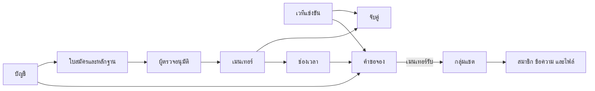

# ChampionWays — รายละเอียดระบบ ฟีเจอร์ และกติกาการทำงาน

อัปเดต 14 กันยายน 2569 จากโค้ดล่าสุดและข้อกำหนดที่เจ้าของโปรเจกต์ตกลง

เอกสารนี้อธิบายข้อมูล สิทธิ์ ขั้นตอน สถานะ และข้อจำกัดของแต่ละระบบ คำว่า **มีในโค้ด** ไม่ใช่การยืนยันว่า deploy และตรวจรับ Production รอบล่าสุดแล้ว ส่วน **ข้อเสนออนาคต** ยังไม่ใช่บริการหรือนโยบายที่เปิดใช้

## 1. ภาพรวมแพลตฟอร์ม

เส้นทางทีม: **เลือก Hackathon/แข่งเคส → อ่านรายละเอียดงาน → ดูเมนเทอร์ที่มีคิว → เปิดโปรไฟล์ → ขอจอง 60 นาที → เมนเทอร์ยืนยัน → คุยในแชตกลุ่ม**

เส้นทางเมนเทอร์: **เข้าสู่ระบบ → โปรไฟล์ของฉัน → สมัครและส่งหลักฐาน → ผู้ตรวจอนุมัติ → เลือกหมวด/งานที่ช่วยได้ → เปิดคิว → รับคำขอ → ปรึกษาทีม**

เส้นทางทีมงาน: **เพิ่มหรือตรวจเวที → ตรวจเมนเทอร์และผลงาน → เผยแพร่ข้อมูล → ติดตามข้อผิดพลาดและช่วยเหลือผู้ใช้**

เริ่มจากงานที่อยากแข่ง ไม่บังคับตอบแบบสอบถามว่าติดตรงไหนก่อนหาเมนเทอร์ รอบปัจจุบันเป็นการคุยผ่านข้อความในเว็บ ไม่เรียกเก็บเงินและไม่มีวิดีโอคอลหรือระบบนัด Meet/Zoom

## 2. ผู้ใช้และสิทธิ์

| ผู้ใช้ | สิทธิ์ | ข้อจำกัด |
|---|---|---|
| ผู้เข้าชม | ค้นหา อ่านรายละเอียดและโปรไฟล์สาธารณะ | จองหรืออ่านแชตส่วนตัวไม่ได้ |
| สมาชิก | จัดการบัญชีตัวเอง สมัครเมนเทอร์ ขอจอง และดูนัดตัวเอง | แก้ข้อมูลคนอื่นหรือยกระดับบทบาทตัวเองไม่ได้ |
| เมนเทอร์ที่ผ่านอนุมัติ | เลือกหมวด/งาน เปิดคิว และตอบคำขอของตนเอง | ตรวจยืนยันรางวัลตนเองไม่ได้ |
| เจ้าของกลุ่ม | เชิญ ยกเลิกคำเชิญ และนำสมาชิกทีมออก | ไม่มีสิทธิ์ในกลุ่มอื่น และใช้ปุ่มนี้นำเจ้าของหรือเมนเทอร์ออกไม่ได้ |
| สมาชิกทีม | อ่าน/ส่งข้อความและไฟล์ในกลุ่มที่เข้าร่วม | เชิญหรือนำคนอื่นออกไม่ได้ |
| ผู้ตรวจ/แอดมิน | ตรวจใบสมัคร เพิ่ม/แก้/เผยแพร่เวที บันทึกผลและเหตุผล | สิทธิ์แอดมินไม่ใช่สิทธิ์เปิดทุกแชต ระบบแชตตรวจสมาชิกกลุ่ม |

บทบาทบัญชีหลักคือ member/reviewer/admin ส่วนเมนเทอร์มาจากโปรไฟล์ที่อนุมัติและเชื่อมบัญชี เจ้าของกลุ่มมาจากผู้เริ่มคำขอของทีมนั้น ไม่ใช่ตัวเลือกในหน้าสมัครสมาชิก

ทุกการเปลี่ยนข้อมูลต้องตรวจสิทธิ์ที่ API การซ่อนปุ่มใน UI อย่างเดียวไม่เพียงพอ เซิร์ฟเวอร์ยึดผู้ใช้จาก session ไม่เชื่อ role/userId ที่ส่งมาเอง

## 3. บัญชีและโปรไฟล์

### สมัครและเข้าสู่ระบบ

- สมัครด้วยชื่อแสดง อีเมล รหัสผ่าน หรือใช้ Google login
- อีเมล trim และแปลงเป็นตัวพิมพ์เล็กก่อนตรวจซ้ำ รหัสผ่านเก็บเป็น hash ด้วย scrypt และ salt ไม่เก็บเป็นข้อความอ่านได้
- ล็อกอินสำเร็จสร้าง session ในฐานข้อมูล อายุ 30 วัน ใช้ cookie แบบ HttpOnly, SameSite=Lax และ Secure เมื่อเป็น production
- Logout ยกเลิก session จริง ไม่ใช่เพียงซ่อนข้อมูลหน้าเว็บ
- หากเข้าสู่ระบบระหว่างขอจอง ให้เก็บปลายทางภายในเว็บเพื่อกลับมาที่งาน/เมนเทอร์เดิม ไม่เปิด redirect ออกเว็บภายนอกตามค่าที่ส่งมา
- ข้อมูลตอบกลับหน้าเว็บไม่รวม password hash หรือรหัส Google ภายใน

### โปรไฟล์ของฉัน

มีหน้า `/profile` และ `/profile/edit` ในโค้ดล่าสุด ข้อมูลบัญชีรองรับชื่อ รูป อีเมล คำแนะนำตัว อาชีพ องค์กร/สถานศึกษา ตำแหน่ง และระดับการศึกษา

หน้าโปรไฟล์รวมข้อมูลบัญชี สถานะใบสมัคร นัดของฉัน และทางเข้าแชต ถ้ายังไม่สมัครมีปุ่มสมัครเมนเทอร์ ถ้าอนุมัติแล้วมีเครื่องมือจัดการความถนัด งานและคิว

โปรไฟล์บัญชีเป็นข้อมูลของเจ้าของบัญชี ส่วนโปรไฟล์เมนเทอร์สาธารณะใช้ข้อมูลที่ผ่านการตรวจ ไม่ควรถือว่าการเปลี่ยนชื่อหรือ bio บัญชีเปลี่ยนหลักฐานที่อนุมัติแล้วอัตโนมัติ

### อีเมลและรหัสผ่าน

- เปลี่ยนอีเมลต้องยืนยันรหัสผ่านปัจจุบัน อีเมลใหม่ไม่ซ้ำ และล้างสถานะยืนยันอีเมลเดิม
- บัญชีที่เชื่อม Google ถูกจำกัดการเปลี่ยนอีเมลผ่านฟอร์มนี้ตามโค้ดปัจจุบัน
- เปลี่ยนรหัสผ่านต้องตรวจรหัสเดิมถ้ามี บัญชี Google ที่ยังไม่มีรหัสผ่านตั้งครั้งแรกผ่าน session ได้
- เปลี่ยนรหัสผ่านสำเร็จยกเลิก session ทุกอุปกรณ์ แล้วออก session ใหม่ให้เครื่องที่เปลี่ยน
- ยังไม่ควรนับว่ามีระบบลืมรหัสผ่านทางอีเมล ยืนยันอีเมลทุกช่องทาง ลบบัญชี หรือส่งออกข้อมูลส่วนตัวครบวงจรโดยไม่ได้ตรวจเพิ่ม

## 4. การค้นหาและรายละเอียดการแข่งขัน

### ประเภทกับหมวดเป็นคนละแกน

| แกน | ค่า | วิธีใช้ |
|---|---|---|
| `kind` | Hackathon / แข่งเคส | เลือกหนึ่งประเภทต่อเวที แสดงป้ายชัดเจน |
| `themes` | นวัตกรรม / ธุรกิจ / การศึกษา / การแพทย์ | เลือกหลายหมวดได้ |

ตัวอย่างเชิงโครงสร้าง: งานทำต้นแบบบริการโรงพยาบาลเป็น Hackathon + นวัตกรรม + การแพทย์ ส่วนงานวิเคราะห์แผนธุรกิจโรงพยาบาลเป็นแข่งเคส + ธุรกิจ + การแพทย์ ไม่เหมารวมประเภทจากหมวด

taxonomy เดิมยังอยู่เพื่อรักษาข้อมูลเก่า งานที่ยังไม่จัดประเภทใหม่ต้องให้ทีมงานจัดก่อนเข้าสู่การสำรวจใหม่ ไม่เดาประเภทจากชื่อเพียงอย่างเดียว

### ข้อมูลของหนึ่งเวที

| กลุ่มข้อมูล | รายละเอียด |
|---|---|
| ตัวตน | รหัส slug ชื่อ ผู้จัด คำอธิบาย ประเภทและหมวด |
| ผู้สมัคร | ระดับการศึกษา คุณสมบัติ ขนาดทีมขั้นต่ำ/สูงสุด |
| กำหนดการ | วันเปิด วันปิด วันกิจกรรมเมื่อมี |
| สถานที่ | ออนไลน์ ภูมิภาค สถานที่จริง |
| รางวัล/ค่าใช้จ่าย | มูลค่ารางวัล คำอธิบายรางวัล และค่าสมัครตามผู้จัด |
| การเตรียมตัว | ภาพรวม รูปแบบ สิ่งที่ต้องส่ง ทักษะและการเตรียมตัว |
| แหล่งที่มา | URL ประกาศ URL สมัคร แหล่งข้อมูล และวันที่ตรวจล่าสุด |

ค่าสมัครแข่งขันเป็นคนละเรื่องกับค่าปรึกษา เว็บยังไม่รับชำระค่าสมัครแทนผู้จัด คำว่า “ตรวจล่าสุด” บอกเวลาตรวจข้อมูล ไม่ใช่การรับรองผลการแข่งขัน

### การทำงานของการค้นหา

- หน้าสำรวจใหม่อยู่ `/explore` กรองประเภทกับหมวดร่วมกันได้ หลายหมวดใช้ตรงอย่างน้อยหนึ่งหมวด และต้องตรงประเภทที่เลือกด้วย
- ค้นหาจากข้อมูลที่ API รองรับ เช่น ชื่อ ผู้จัด คำอธิบายและ keywords
- คำค้น ตัวกรอง ลำดับและหน้าอยู่ใน URL จึงแชร์ รีเฟรช และย้อนกลับได้
- เรียงใกล้ปิดรับ เพิ่มล่าสุด หรือชื่อเวที แสดงผลว่างเมื่อไม่มีข้อมูลจริงที่ตรงเงื่อนไข
- บันทึกเวทีด้วย slug ในเบราว์เซอร์ ไม่ใช่ favorites ที่ซิงก์ข้ามอุปกรณ์ผ่านบัญชี
- รายละเอียดแสดงข้อมูลและส่วนที่มีจริง ไม่แต่งผู้จัด รางวัลหรือกำหนดการเพื่อเติมหน้าว่าง
- ลิงก์เวทีผิดหรือไม่พบต้องแสดงหน้ารองรับ ไม่แสดงอีกเวทีแทน
- ส่วนเมนเทอร์ของงานแสดงผู้ตรงเกณฑ์และมีคิว พร้อมเหตุผล เวลาเร็วที่สุด และปุ่มโปรไฟล์/ขอจอง

## 5. เพิ่มเวทีและตรวจประกาศ

### ทีมงานเพิ่มเอง

ผู้ตรวจหรือแอดมินใช้ `/admin/listings` เพิ่ม แก้ และทำเครื่องหมายตรวจข้อมูลล่าสุด กรอกประเภท/หมวด รายละเอียด รางวัล คุณสมบัติ และ URL ต้นทาง API ตรวจฟิลด์บังคับ รูปแบบ URL และช่วงขนาดทีมด้วย

การเพิ่มเองเป็นช่องทางทีมงานคัดข้อมูล ไม่ใช่ฟอร์มที่สมาชิกทั่วไปใช้เผยแพร่ทันที ต้องตรวจต้นทางก่อนกรอกตาม checklist ของกองบรรณาธิการ

### ผู้จัดเสนอการแข่งขัน

ผู้จัดกรอกข้อมูลองค์กร ชื่อ/ตำแหน่งผู้ติดต่อ อีเมล เบอร์โทร และรายละเอียดงาน ข้อมูลติดต่อใช้ตรวจสอบ ไม่ใช่ข้อมูลสาธารณะทั้งหมด ต้องเข้าสู่ระบบก่อนส่ง

ขั้นตอน: ข้อมูลผู้จัด → รายละเอียดและคุณสมบัติ → หลักฐาน/ต้นทาง → ตรวจทานและยินยอม → เข้าคิวผู้ตรวจ

| สถานะ | ความหมายและผล |
|---|---|
| pending | รอตรวจ ยังไม่เป็นเวทีสาธารณะ |
| info | ผู้ตรวจขอข้อมูลเพิ่ม ต้องมีเหตุผล |
| published | ผ่านตรวจ สร้างเวทีและเชื่อมกลับใบเสนอ |
| rejected | ไม่ผ่าน มีเหตุผล ไม่สร้างเวทีจากใบนั้น |

รายการตรวจ: ต้นทางเปิดได้ ผู้จัดตรงประกาศ วันรับสมัครถูกต้อง รางวัล/ค่าใช้จ่ายตรง ไม่คัดลอกคำบรรยายทั้งก้อน และไม่ใช่งานขายหรือรับสมัครงานที่แฝงเป็นการแข่งขัน มีประวัติผู้ตรวจ ผล เวลาและหมายเหตุ

ทางเข้าฟอร์มผู้จัดจากหน้าสาธารณะเคยถูกพักระหว่างเตรียมอีเมล ต้องตรวจการเปิดทางเข้าและส่งอีเมลจริงก่อนประชาสัมพันธ์ว่าครบวงจรแล้ว

## 6. นำเข้าข้อมูลและ Cron — ระบบที่ออกแบบไว้สำหรับพัฒนาต่อ

### แหล่งและช่องทาง

- [YSC/สวทช. RSS](https://www.nstda.or.th/ysc/feed/): มีประกาศโครงงาน พร้อมข่าวผลและเกียรติบัตรปน
- [NECTEC RSS](https://www.nectec.or.th/feed/): มีข่าวการแข่งขันเทคโนโลยีและข่าวองค์กร
- [Contest Thailand RSS](https://contest-thailand.com/feed/): ใช้ค้นพบงานหลายหมวด แล้วตามไปยืนยันกับผู้จัด
- NIA และ CEA: อ่าน HTML ของลิงก์เฉพาะได้ ต้องทำ adapter และตรวจเงื่อนไขก่อนเปิดอัตโนมัติ

ผลการทดสอบอ่านอยู่ใน [DATA-SOURCES.md](DATA-SOURCES.md) อ่านได้ไม่ได้หมายความว่ามีสิทธิ์นำบทความหรือภาพทั้งหมดมาเผยแพร่ซ้ำ

### ข้อมูลและขั้นตอน

เก็บแหล่ง URL ปกติ รหัสข่าว hash เนื้อหา เวลาอ่าน เวลาประกาศ ข้อมูลที่แยกได้ หลักฐานรายฟิลด์ ข้อสงสัย สถานะ ผู้ตรวจ และรหัสเวทีหลังเผยแพร่ แยกข้อมูลต้นทางออกจากร่างที่คนแก้เสมอ

ข่าวเข้า → แยกรับสมัคร/ผล/ข่าวทั่วไป → อ่านรายละเอียด → ตรวจปีและ deadline → ตรวจซ้ำ → รอตรวจ → ผู้ตรวจแก้แล้วเผยแพร่หรือข้าม

ข่าวที่อาจซ้ำให้เสนอเชื่อมเวทีเดิม ไม่รวมจากชื่อคล้ายเพียงอย่างเดียว ค่าไม่ทราบให้เว้นว่างและแจ้งผู้ตรวจ ไม่ตีความว่าเงินรางวัล 0 หรือสมัครฟรี

### Cron และความล้มเหลว

- แผนรันวันละครั้งช่วงประมาณ 08:00 เวลาไทย ผ่าน Vercel Cron และตรวจ secret ที่ backend
- เฉพาะแหล่งที่แอดมินอนุมัติ จำกัดเวลา ขนาดข้อมูล จำนวนหน้าและ concurrency
- กันงานซ้ำด้วย task/lease หาก Cron กับปุ่มดึงเองมาพร้อมกันไม่ประมวลผลรายการเดียวกันซ้ำ
- timeout/429/5xx เก็บสถานะและ retry แบบ backoff งานเกินเวลาบันทึกค้างให้รอบต่อไปหรือปุ่มทำงานค้างต่อ
- ต้นทางเปลี่ยนให้เก็บ revision และขึ้นรอตรวจ ไม่ทับข้อความที่ทีมงานเขียนเอง
- ต้นทางเข้าไม่ได้ไม่ใช่เหตุให้ลบเวที และข่าวที่ยังเขียนว่าเปิดรับไม่ได้แปลว่ายังไม่หมดเขต
- ห้ามเผยแพร่อัตโนมัติหรือเปลี่ยนวันเป็นปีถัดไปเอง
- ทิศทางใหม่คัดเฉพาะงานที่จัดเป็น Hackathon/แข่งเคสได้ ไม่ดึงค่าย ทุน หรือข่าวทุกประเภทมาแสดงปน

รายละเอียดตาราง API และการป้องกัน URL อันตรายอยู่ใน [NEXT-STEPS.md](NEXT-STEPS.md) หัวข้อ 6 ยังไม่ได้เปิด Cron ในงานเอกสารนี้

## 7. สมัครเป็นเมนเทอร์

### ข้อมูลที่กรอกและเหตุผล

| ข้อมูล | ใช้ทำอะไร |
|---|---|
| ชื่อ นามสกุล ชื่อเล่น อีเมล | ระบุผู้สมัคร ติดต่อและเชื่อมบัญชี |
| อาชีพ องค์กร ตำแหน่ง ประสบการณ์ | อธิบายพื้นฐานที่เกี่ยวข้อง |
| รางวัลสูงสุด 2 งาน พร้อมปีและหลักฐาน | ให้ผู้ตรวจยืนยันผลงาน |
| Portfolio | แสดงผลงาน รวมกรณีไม่มีรางวัล |
| ช่วยได้ดีที่สุด/ช่วยไม่ได้ | กำหนดขอบเขตความคาดหวัง |
| ความถนัด 2 หัวข้อ | วิธีช่วยทีม เช่น วิเคราะห์โจทย์ วางแผน ต้นแบบ สไลด์ Pitch |
| ความยินยอม | ยืนยันข้อมูลและรับกติกา |

ความถนัด 2 หัวข้อเป็น “วิธีช่วยทีม” ต่างจาก 4 หมวดเนื้อหา เช่น ถนัด Pitch และช่วยงานหมวดการแพทย์ได้

### ฟอร์มและการส่ง

1. ข้อมูลผู้สมัครและรูปที่เลือก
2. ประสบการณ์ รางวัล/หลักฐาน และ Portfolio; ไม่มีรางวัลใช้ผลงานประกอบได้
3. ขอบเขตช่วยได้/ช่วยไม่ได้และความถนัด ทิศทางใหม่ไม่มีราคาและคิวเสียเงิน
4. ตรวจตัวอย่างโปรไฟล์และข้อมูลส่วนตัว กลับไปแก้แต่ละขั้น แล้วติ๊กเงื่อนไขก่อนส่ง

ต้องเข้าสู่ระบบก่อนส่ง ตรวจข้อมูลทั้งหน้าเว็บและ API ย้อนขั้นได้ เมื่อแก้ข้อมูลหลังยืนยันความถูกต้องให้ล้าง checkbox ข้อนี้เพื่อทบทวนใหม่ ไม่ต้องบังคับติ๊กไว้ล่วงหน้า

เงื่อนไขหลัก: ข้อมูลและหลักฐานเป็นของผู้สมัครและยินยอมให้ตรวจ ไม่ทำผลงานแทนทีม ไม่รับงานนอกระบบกับลูกค้าที่พบในแพลตฟอร์ม และไม่ปรึกษาทีมที่ตนเป็นกรรมการ การติ๊กยินยอมไม่แทนการตรวจพฤติกรรมจริง

### ข้อมูลสาธารณะและข้อจำกัด

เผยแพร่หลังอนุมัติเท่านั้น แสดงชื่อ/นามสกุลย่อ ประสบการณ์ ขอบเขต และผลงานที่ตรวจแล้ว ไม่เปิดอีเมล นามสกุลเต็มและหลักฐานส่วนตัวทั้งหมด

ฟอร์มเลือกไฟล์ต้องตรวจการเชื่อมอัปโหลดให้ครบ การเห็นชื่อไฟล์ไม่ใช่หลักฐานว่าไฟล์ขึ้นเซิร์ฟเวอร์แล้ว การกลับมาแก้ใบสมัครและส่งหลักฐานเพิ่มยังต้องตรวจ/พัฒนาเส้นทางครบวงจร ข้อมูลบัญชีกับใบสมัครที่ผ่านตรวจเป็นคนละชุด

## 8. ตรวจและอนุมัติเมนเทอร์

### ผู้ตรวจพิจารณาอะไร

- ตัวตนและประสบการณ์สอดคล้องกับข้อมูลผู้สมัคร
- หลักฐานเป็นของผู้สมัครหรือทีมที่เกี่ยวข้อง แยกผู้เข้าร่วมออกจากผู้ได้รับรางวัล
- ชื่องาน ปี ระดับรางวัล และลิงก์ประกาศตรงกันและเปิดตรวจได้
- ขอบเขตคำปรึกษาไม่เสนอรับทำแทนหรือชวนจ่ายนอกระบบ
- ข้อมูลที่จะเผยแพร่ไม่มีรายละเอียดส่วนตัวที่ไม่ควรสาธารณะ

ยังเป็นการตรวจโดยคน ไม่ใช่ระบบตรวจบัตรประชาชนหรือคุณวุฒิอัตโนมัติ

### ผลตรวจ

| ผล | ผลต่อผู้สมัครและระบบ |
|---|---|
| pending | รอทีมงานตรวจ ยังไม่ได้สิทธิ์เมนเทอร์จากใบนี้ |
| info | ขอข้อมูลเพิ่ม ต้องระบุอะไรขาดหรือไม่ตรง ยังไม่เผยแพร่ |
| published | สร้างโปรไฟล์และเชื่อมบัญชี ได้จัดหมวด/งาน/คิวตามสิทธิ์ |
| rejected | ไม่ผ่านพร้อมเหตุผล ไม่สร้างโปรไฟล์จากใบนี้ |

มีประวัติผู้ตรวจ เวลา ผลและหมายเหตุ การมีโปรไฟล์อนุมัติไม่แปลว่าทุกรางวัลถูกยืนยัน และไม่แปลว่าจะขึ้นทุกงานทันที ต้องผ่านการจับคู่และมีคิวด้วย

### การยืนยันหลักฐานรายหมวด

หลักฐานเก็บชื่อผลงาน ปี หมวดที่ผู้ตรวจยืนยัน ผู้ยืนยันและเวลา เฉพาะผู้ตรวจ/แอดมินแก้ข้อมูลการยืนยัน เมนเทอร์เลือกหมวดความถนัดเองได้ แต่ให้ตราว่ารางวัลผ่านตรวจเองไม่ได้

หลักฐานที่ยืนยันแล้วให้คะแนนจับคู่ตามหมวด เมื่อแก้หลักฐานให้คำนวณใหม่ การพบชื่อเวทีตรงกันเพียงอย่างเดียวไม่ควรถูกตีความว่าเป็นหลักฐานชนะจริง

ระบบจัดการระงับเมนเทอร์ การอุทธรณ์ และผลต่อนัดที่มีอยู่ยังต้องกำหนดแยก ไม่ใช่สิ่งเดียวกับปฏิเสธใบสมัครใหม่

## 9. การจับคู่เมนเทอร์กับงาน

ใช้กฎที่อธิบายได้ ไม่เรียก AI ภายนอก มีสองทางเข้ารายชื่อคือเมนเทอร์เลือกช่วยงานนี้โดยตรง หรือหมวดที่คำนวณได้ตรงกับงาน หากระบุยกเว้น/ไม่รับงานนั้นให้ตัดออกแม้คะแนนตรง

### สูตรต่อหมวด

| องค์ประกอบ | คะแนนสูงสุด |
|---|---:|
| มีผลงานที่ผู้ตรวจยืนยันหมวดแล้วอย่างน้อยหนึ่งชิ้น | 6 |
| เมนเทอร์ยืนยันว่าถนัดหมวดนี้ | 3 |
| คำสำคัญในประสบการณ์ คำละ 1 | 2 |
| คำสำคัญในสิ่งที่ช่วยได้ คำละ 1 | 2 |
| รวม | 13 |

คะแนนตั้งแต่ 3 ใช้จับคู่ได้ เว้นแต่เมนเทอร์ปิดหมวดนั้น ไม่บวก 6 ซ้ำทุกผลงานในหมวดเดียว และคะแนนไม่ใช่เปอร์เซ็นต์คุณภาพหรือคุณวุฒิ

ตัวอย่างสูตร: ไม่มีรางวัลที่ตรวจแล้ว แต่ยืนยันธุรกิจ (+3) มี business และ marketing ในประสบการณ์ (+2) และแผนธุรกิจในสิ่งที่ช่วยได้ (+1) รวมธุรกิจ 6 คะแนน

Normalize ตัวพิมพ์และช่องว่าง นับคำซ้ำเพียงครั้งเดียวในแต่ละช่อง ไม่ใช้คำในช่อง “ช่วยไม่ได้” เก็บผลพร้อมเวอร์ชันกฎและเหตุผล ไม่สรุปว่าเป็นแพทย์หรือผู้เชี่ยวชาญวิชาชีพจาก keywords

### กรองและเรียง

ต้องผ่านอนุมัติ มีบัญชีเชื่อม มีช่องอนาคตที่ว่าง และไม่ยกเว้นงาน หากไม่ได้เลือกช่วยโดยตรงต้องมีหมวดตรงเกณฑ์

เรียงตาม: เลือกช่วยงานโดยตรง → จำนวนหมวดตรง → รวมคะแนนหมวดตรง → คิวว่างเร็วที่สุด → รหัสเมนเทอร์เพื่อให้ลำดับคงที่

แสดงเหตุผล “เลือกช่วยงานนี้”, “ผลงานที่ตรวจแล้วตรงหมวดธุรกิจ” หรือ “ความถนัดตรงหมวดการศึกษา” ไม่ใช้ป้ายยอดนิยม ดีที่สุด หรือรับรองโอกาสชนะโดยไม่มีข้อมูล

## 10. คิวและการจอง

### ข้อมูลที่เก็บ

ช่องเวลาเก็บเมนเทอร์ เวลาเริ่ม/จบ สถานะปิดช่องและเวลาสร้าง คำขอเก็บเจ้าของทีม เมนเทอร์ งาน ช่อง ชื่อทีม บริบท สถานะ วันหมดอายุ เหตุผล ห้องแชต และผู้แก้ล่าสุด มีประวัติว่าใครส่ง รับ ปฏิเสธหรือยกเลิกเมื่อใด

### เปิดคิว

- เฉพาะเมนเทอร์ที่ผ่านอนุมัติ เปิดช่องอนาคตครั้งละ 60 นาที แสดงเวลาไทย เก็บ UTC
- เปิดทับช่องที่ยังไม่ปิดไม่ได้ แต่เปิดติดกัน 10:00–11:00 และ 11:00–12:00 ได้
- ปิดช่องว่างได้ ถ้ามีคำขอรอหรือนัดยืนยันต้องจัดการนัดก่อน ไม่ทำให้นัดของทีมหลุดเงียบ ๆ
- รอบแรกไม่มีคิวประจำสัปดาห์หรือการจองหลายระยะเวลา

### ขอจองและกันคิว

1. เลือกงาน เมนเทอร์ และช่องที่ว่าง กรอกชื่อทีม/บริบท
2. API ตรวจผู้ขอ เมนเทอร์ งานและช่อง ผู้ใช้จองตนเองไม่ได้
3. สร้างคำขอ pending และกันช่องทันที ไม่ให้ทีมอื่นจองเวลาเดียวกัน
4. คำขอหมดอายุเมื่อครบ 24 ชั่วโมงหรือถึงเวลาเริ่ม แล้วแต่ว่าอย่างใดถึงก่อน
5. หนึ่งเจ้าของทีมมีคำขอรอได้หนึ่งรายการต่อเมนเทอร์และงาน ไม่ใช่เพียงนัดเดียวตลอดชีวิต

### สถานะและการกระทำ

| สถานะ | เกิดเมื่อ | ทำอะไรต่อได้ |
|---|---|---|
| รอยืนยัน | ส่งแล้ว ยังไม่หมดอายุ | เมนเทอร์รับ/ปฏิเสธ คู่กรณียกเลิกก่อนเริ่ม |
| ยืนยันแล้ว | เมนเทอร์รับและยืนยันว่าไม่ได้ตัดสินทีมนี้ | เข้ากลุ่มแชต ยกเลิกก่อนเริ่ม |
| ปฏิเสธ | เมนเทอร์ไม่รับพร้อมเหตุผล | ช่องกลับมาว่างถ้ายังเป็นอนาคต |
| ยกเลิก | คู่กรณียกเลิกพร้อมเหตุผลก่อนเริ่ม | ขอเวลาใหม่ได้ ประวัติ/แชตเดิมไม่ถูกลบ |
| หมดอายุ | ไม่ได้รับก่อนเส้นตาย | รับคำขอเดิมไม่ได้ ต้องขอใหม่ |
| พ้นเวลานัด | เวลาจบผ่านสำหรับนัดที่ยืนยัน | ยังดูประวัติได้ ไม่เท่ากับยืนยันบริการสำเร็จ |

เมนเทอร์เท่านั้นรับ/ปฏิเสธคำขอถึงตนได้ เจ้าของทีมและเมนเทอร์ยกเลิกก่อนเริ่มได้พร้อมเหตุผล สมาชิกทีมที่ถูกเชิญไม่มีสิทธิ์ยกเลิกแทน

รับแล้วสร้างหรือใช้กลุ่ม active เดิมของเจ้าของทีม–เมนเทอร์–งาน กดรับซ้ำต้องไม่สร้างห้องซ้ำ การเลื่อนรอบแรกใช้ยกเลิกแล้วขอใหม่

### กรณีผิดปกติ

- สองทีมกดพร้อมกัน: เซิร์ฟเวอร์ใช้ transaction/lock ให้สำเร็จเพียงทีมเดียว
- ตอนรับต้องตรวจคิวอีกครั้ง ไม่เชื่อเพียงว่า UI เคยบอกว่าง
- การปล่อยคำขอหมดอายุคำนวณจากเวลาฐานข้อมูล ไม่ต้องรอ Cron
- เมนเทอร์ยกเว้นงานหรือหมดสิทธิ์ก่อนรับต้องไม่รับผ่านสถานะเก่า
- เมนเทอร์ไม่มา: ยังไม่มีการตรวจขาดนัดอัตโนมัติ และไม่เกิด refund เพราะยังไม่มีการรับเงิน
- การยกเลิกหลังเริ่มและการช่วยเหลือกรณีฉุกเฉินยังต้องกำหนดเป็นงานแยก

## 11. แชตกลุ่มและไฟล์

### กลุ่มและสมาชิก

กลุ่มเกิดจากคำขอจองที่รับแล้ว มีชื่อ บริบทงาน เจ้าของ เมนเทอร์ สมาชิก นัด และข้อความ ใช้กลุ่มเดิมสำหรับทีม–เมนเทอร์–งานเดียวกัน ไม่ต้องแยกทุกนัด

- เฉพาะเจ้าของเชิญด้วยอีเมล ยกเลิกคำเชิญและนำสมาชิกทีมออกได้
- ผู้รับเห็นคำเชิญในหน้าแชต ต้องใช้อีเมลตรงและยืนยันแล้ว Google เป็นช่องทางยืนยันที่รองรับ
- คำเชิญหมดอายุ 7 วัน รับซ้ำไม่สร้างสมาชิกซ้ำ ไม่มีอีเมลคำเชิญอัตโนมัติในรอบนี้
- สมาชิกใหม่อ่านประวัติเดิมได้ จึงต้องเลือกผู้รับให้เหมาะก่อนเชิญ
- ผู้ถูกนำออกเปิดข้อความ/ไฟล์ต่อผ่าน API ไม่ได้ แต่เรียกคืนไฟล์ที่ดาวน์โหลดไปก่อนหน้าไม่ได้
- เจ้าของและเมนเทอร์ไม่ใช่เป้าหมายของปุ่มนำสมาชิกออก การโอนเจ้าของ/เปลี่ยนเมนเทอร์กลางกลุ่มยังไม่กำหนดครบ

### ข้อความและสถานะอ่าน

รองรับข้อความไม่เกิน 4,000 ตัวอักษร แสดงผู้ส่ง เวลาและจำนวนผู้อ่าน ใช้ clientId กันส่งซ้ำเมื่อ retry โหลดประวัติเป็นหน้า และรักษาตำแหน่งเมื่ออ่านย้อนหลัง

แชตตรวจข้อความใหม่ประมาณทุก 3 วินาทีขณะเปิดหน้า inbox ประมาณทุก 5 วินาที เป็น polling ไม่ใช่ WebSocket สถานะอ่านไม่ใช่หลักฐานว่าคำปรึกษาครบหรือผู้รับเข้าใจแล้ว

คุยและส่งไฟล์ก่อน/หลังนัดได้ ห้องไม่ปิดเมื่อครบ 60 นาที ไม่มีฟอร์ม Meet/Zoom หรือคอลภายนอก แต่ส่งลิงก์อ้างอิงงานหรือผลงานได้

### ไฟล์แชต

- JPG/PNG/WebP/PDF สูงสุด 2 MB ตรวจชนิด ขนาดและ signature เบื้องต้น ไม่ใช่ antivirus เต็มระบบ
- เก็บ base64 ในฐานข้อมูล ดาวน์โหลดผ่าน API ตรวจสมาชิก ไม่ใช้ลิงก์ public upload ทั่วไป
- ใช้ no-store และดาวน์โหลดแบบ attachment ผู้ที่ไม่ใช่สมาชิกไม่มีสิทธิ์เปิด
- ไฟล์ที่ส่งแชตไม่ถูกนำเข้าใบสมัครเมนเทอร์เอง
- ก่อนรองรับผู้ใช้มากต้องวาง private object storage และโควตา เนื่องจาก base64 เพิ่มภาระฐานข้อมูล

## 12. การแจ้งเตือนและอีเมล

### ภายในเว็บ

โปรไฟล์และแชตแสดงสถานะใบสมัคร คำขอจอง นัดและคำเชิญตามสิทธิ์ การจองใช้สถานะในฐานข้อมูลเป็นหลัก ไม่ต้องรออีเมลถึงจึงจะมีนัด

### อีเมล

มีการเรียกส่งเมื่อรับใบสมัครและเมื่อผู้ตรวจตัดสิน ใช้ Resend เมื่อกำหนดค่าพร้อม และเก็บ email_log หากส่งล้มเหลวต้องแสดง/บันทึกผลให้ทีมงานตรวจ ไม่ตีความว่าใบสมัครล้มเหลวเพียงเพราะอีเมลส่งไม่ผ่าน

แยกสามอย่าง: **บันทึก log → provider รับคำขอส่ง → อีเมลถึงผู้รับ** การมี log หรือ HTTP สำเร็จไม่ได้ยืนยันการเข้ากล่องขาเข้าหรือการเปิดอ่าน

ยังไม่ควรนับว่ามี push, LINE notification, นัดเตือนอัตโนมัติ หรือ retry/reconciliation อีเมลครบวงจร ต้องตรวจโดเมนผู้ส่งและทดสอบปลายทางจริง

## 13. จ่ายเงินและจ่ายเมนเทอร์ — ข้อเสนออนาคตที่พักไว้

**ยังไม่มีการรับเงินจริง ไม่ได้ตกลงค่าบริการ/ส่วนแบ่งเป็นข้อยุติ และยังไม่ได้เลือก provider เป็นข้อยุติ** รายละเอียดนี้เป็นสิ่งที่ต้องออกแบบก่อนทำ ไม่ใช่บริการปัจจุบัน

### ใครจ่ายและจ่ายเพื่ออะไร

แนวคิดเดิมคือเจ้าของกลุ่มจ่ายครั้งเดียวทั้งทีมต่อนัด สมาชิกที่เชิญไม่ถูกเก็บแยก ราคาหารต่อคนเป็นข้อมูลช่วยตัดสินใจ ไม่ใช่หลายธุรกรรม ค่าสมัครงานแข่งขันกับผู้จัดไม่รวมอยู่ในค่าปรึกษา

### ขั้นตอนรับเงินที่เสนอ

1. ตกลงนัดกับเมนเทอร์
2. สร้าง payment ผูก booking และเก็บราคา ณ เวลาซื้อ ไม่อ่านราคาจากโปรไฟล์ใหม่มาทับยอดเก่า
3. ก่อนจ่ายแสดงยอด สกุลเงิน รายละเอียดนัด และเงื่อนไขยกเลิก
4. สร้าง checkout/QR เฉพาะธุรกรรมผ่าน provider ที่รองรับรูปแบบธุรกิจ
5. รับ webhook ที่ backend ตรวจความถูกต้องของข้อความ ยอด สกุลเงินและรหัสธุรกรรม
6. ยืนยัน paid เมื่อได้รับผลที่ตรวจสอบได้ ไม่ใช้สลิปหรือหน้า redirect เพียงอย่างเดียว

| สถานะรับเงินที่เสนอ | ความหมาย |
|---|---|
| รอชำระ | สร้างรายการ ยังไม่มีผลรับเงินจริง |
| กำลังตรวจ | provider ยังไม่ยืนยันผลสุดท้าย |
| ชำระแล้ว | ตรวจยอดและผลจาก provider แล้ว |
| ไม่สำเร็จ/หมดอายุ | ไม่ถือว่า paid ต้องลองใหม่ตามกติกา |

เก็บ paymentId, bookingId, payerId, amount, currency, providerPaymentId, status, expiresAt, paidAt และประวัติ webhook ไม่เก็บข้อมูลบัตรเต็มในเว็บ

webhook ซ้ำต้องไม่ลงเงินซ้ำ การจ่ายหลังคิวหมดอายุหรือยอดไม่ตรงต้องเข้าคิวตรวจ ไม่ยืนยันนัดใหม่ทับทีมอื่น การเปลี่ยนจากแชตไม่เก็บเงินไปเป็นบริการเสียเงินต้องกำหนดจังหวะยืนยันคิวใหม่อย่างชัดเจน

### จ่ายให้เมนเทอร์

เงินที่รับไม่เท่ากับเงินพร้อมโอน ต้องแยกยอดรับ ค่าผู้ให้บริการ ค่าบริการแพลตฟอร์ม เงินคืน เงินพักจากข้อร้องเรียน และยอดสุทธิ

ข้อมูล payout ที่ต้องมี: เมนเทอร์ บัญชีรับที่ตรวจแล้ว นัดที่รวมจ่าย ยอดสุทธิ ผู้อนุมัติ providerTransferId และสถานะรอ/พัก/กำลังโอน/สำเร็จ/ล้มเหลว

แนวคิดรอ 24 ชั่วโมงหลังคุยเป็นช่วงที่เสนอไว้เพื่อตรวจปัญหาก่อนเริ่มจ่าย ไม่ใช่คำรับรองว่าเงินเข้าธนาคารตรง 24 ชั่วโมง และต้องมีหลักฐานว่าการปรึกษาเกิดขึ้นจริงก่อนทำอัตโนมัติ

**ยังต้องตกลง:** รูปแบบรับเงินและจ่ายต่อที่ provider รองรับ ราคา ส่วนแบ่ง ผู้รับค่าธรรมเนียม การตรวจบัญชีเมนเทอร์ รอบจ่าย เอกสารรับเงิน และผู้รับผิดชอบกรณีผิดปกติ

## 14. คืนเงินและข้อร้องเรียน — ข้อเสนออนาคตที่พักไว้

**ยังไม่มีการคืนเงินจริง** การยกเลิกนัดปัจจุบันเปลี่ยนสถานะ/ปล่อยคิว ไม่ได้ทำธุรกรรมธนาคาร เพราะยังไม่รับเงิน

### กรณีที่ต้องกำหนดกติกา

| เหตุการณ์ | ข้อเสนอเดิมหรือเรื่องที่ยังต้องตัดสินใจ |
|---|---|
| เมนเทอร์ไม่มา | เคยเสนอคืนเต็มจำนวน ต้องกำหนดเวลารอและหลักฐานก่อนใช้จริง |
| เมนเทอร์ยกเลิก | ต้องให้เลือกคืนหรือจองใหม่ และตกลงใครรับค่าธรรมเนียม |
| ทีมยกเลิกล่วงหน้า | ยังไม่ตกลงเส้นตายและสัดส่วนคืน |
| ทีมไม่มา | ยังไม่ตกลงสิทธิ์คืนและวิธีตรวจ |
| ปรึกษาไม่ครบ/คุณภาพมีปัญหา | ต้องมีคนตรวจและเกณฑ์ ไม่คืนอัตโนมัติจากคำกล่าวอ้างฝ่ายเดียว |
| ระบบขัดข้อง | ตรวจช่วงเวลาและผลกระทบก่อนตัดสิน |
| จ่ายซ้ำ/จ่ายหลังคิวหมด | ตรวจธุรกรรมและยอด ไม่สร้างนัดซ้ำเพื่อให้ยอดตรง |

ยังไม่กำหนดตัวเลขคืนหรือเส้นตายใหม่ในหน้าเว็บจนกว่าเจ้าของโปรเจกต์ตกลงและ provider รองรับ

### ขั้นตอนคืนเงินที่เสนอ

เจ้าของทีมเปิดเรื่อง → ผูก booking/payment → เก็บเหตุผลและหลักฐาน → พัก payout ที่เกี่ยวข้อง → ผู้ดูแลตรวจ → อนุมัติ/ปฏิเสธพร้อมเหตุผล → สั่ง refund ที่ provider → รอผลจริง → แจ้งผู้เกี่ยวข้อง

| สถานะคืนเงิน | ความหมาย |
|---|---|
| ขอคืน/กำลังตรวจ | ยังไม่ตัดสิน |
| อนุมัติ | ผู้ดูแลอนุมัติ แต่เงินยังไม่จำเป็นต้องคืนแล้ว |
| กำลังคืน | ส่งคำสั่งให้ provider |
| คืนสำเร็จ | provider ยืนยันผล |
| คืนไม่สำเร็จ | ต้อง retry หรือแก้ตามเหตุผล |
| ไม่อนุมัติ | มีเหตุผลและประวัติการตัดสิน |

เก็บ refundId, paymentId, bookingId, amount, reason, หลักฐาน, ผู้ตัดสิน, providerRefundId และเวลาแต่ละขั้น ยอดคืนสะสมต้องไม่เกินยอดรับจริง คำสั่งซ้ำไม่คืนซ้ำ ต้องมี reconciliation เมื่อขาดการเชื่อมต่อระหว่างสั่งและรับผล

### ความเป็นส่วนตัวในข้อร้องเรียน

หากให้ผู้ดูแลตรวจแชตต้องกำหนดขอบเขต เหตุผล การแจ้งผู้ใช้ และ audit แยก ปัจจุบันสิทธิ์แอดมินไม่ได้แปลว่าเปิดทุกกลุ่มได้

เวลาในข้อความและสถานะอ่านอย่างเดียวพิสูจน์ไม่ได้ว่าการปรึกษาครบหรือคุณภาพเหมาะสม ระบบเช็กอิน ยืนยันจบ บันทึกขาดนัด และไกล่เกลี่ยยังต้องออกแบบก่อนจ่ายเงินอัตโนมัติ

## 15. ฐานข้อมูลและความสัมพันธ์

เทคโนโลยีหลัก: React/TypeScript/Vite → Hono API → Drizzle → PostgreSQL บน Neon; deploy ด้วย Vercel

| กลุ่ม | ตาราง/ข้อมูลหลัก | เชื่อมกับอะไร |
|---|---|---|
| บัญชี | users, sessions | ผู้ใช้มีหลาย session |
| เวที | competitions และตารางหมวด/ระดับ/รางวัล | มี slug, kind, themes |
| ใบเสนอเวที | competition_submissions และข้อมูลประกอบ | ผู้ส่งและเวทีหลังเผยแพร่ |
| ใบสมัคร | mentor_submissions, mentor_awards | ผู้สมัคร หลักฐานและผลตรวจ |
| เมนเทอร์ | mentors | ใบสมัครที่อนุมัติและบัญชี |
| จับคู่ | mentor_competition_choices, mentor_match_audit | งานเลือก/ยกเว้น คะแนนและเวอร์ชัน |
| คิว | mentor_slots | ช่องของเมนเทอร์ |
| นัด | bookings, booking_events | เจ้าของ เมนเทอร์ งาน ช่องและกลุ่ม |
| แชต | chat_rooms, chat_members, chat_invites, chat_messages | สมาชิก คำเชิญ ข้อความ ไฟล์ |
| ตรวจงาน | review_events | ผู้ตรวจ ผล เหตุผลและเวลา |
| ไฟล์/อีเมล | files, email_log | เจ้าของไฟล์และบันทึกการส่ง |

ตาราง import/payment/refund/payout ที่เสนอด้านบนยังไม่ถือว่ามีครบในระบบ

### Environment และการดูแล

- main เป็น Production และ dev เป็น Preview ฐานข้อมูล production/dev/test แยกกัน
- Automated test ที่ reset/seed ใช้ test เท่านั้น ไม่ใช้ Production
- schema เปลี่ยนผ่าน migration ตรวจข้อมูลเก่าก่อน deploy โค้ดที่พึ่งคอลัมน์ใหม่
- ลบ demo จาก Production 14 เวที/6 เมนเทอร์พร้อม backup แล้ว ไม่ได้ล้างบัญชีหรือใบสมัครทั้งหมด
- ไฟล์แชตส่วนตัวเป็นคนละระบบกับ upload adapter ทั่วไปที่มีดิสก์ local/Blob ตาม config ต้องตรวจสิทธิ์หลักฐานเมนเทอร์แยก
- ต้องมีการสำรอง ทดลองกู้คืน ติดตาม API error การส่งอีเมล การจองชนและพื้นที่ไฟล์ก่อนเพิ่มผู้ใช้

## 16. ฟีเจอร์ที่ยังไม่ควรถือว่ามีครบและเรื่องที่ยังต้องตัดสินใจ

| เรื่อง | ข้อจำกัด/งานต่อ |
|---|---|
| โปรไฟล์และจองใหม่ | มี implementation ในโค้ดล่าสุด เอกสารนี้ไม่ได้รันทดสอบหรือยืนยัน Production รอบใหม่ |
| หลักฐานเมนเทอร์ | ตรวจให้ครบ UI/API/storage/สิทธิ์ ชื่อไฟล์ไม่เท่ากับอัปโหลดสำเร็จ |
| ใบสมัครขอข้อมูลเพิ่ม | ต้องตรวจเส้นทางแก้และส่งกลับครบวงจร |
| อีเมล | ตรวจผู้ส่ง การส่งจริงและการจัดการล้มเหลว |
| ขาดนัด/จบบริการ | ยังไม่ควรสรุปอัตโนมัติจากการหมดเวลา |
| ยกเลิกหลังเริ่ม | ต้องกำหนดกระบวนการช่วยเหลือแยก |
| เงิน/คืนเงิน/ส่วนแบ่ง | พักไว้ ยังไม่เลือก provider และกติกาครบ |
| เปลี่ยนเมนเทอร์/โอนเจ้าของ/ปิดกลุ่ม | ยังไม่กำหนดครบ ไม่ใช่ปุ่มนำสมาชิกออก |
| รายงาน/ระงับเมนเทอร์ | ต้องกำหนดหลักฐาน สิทธิ์ อุทธรณ์ และผลต่อนัดเดิม |
| Cron | แผนดึงร่างเท่านั้น ยังไม่เปิดใช้งานจากเอกสารนี้ |
| Mobile | พักตรวจบัคเฉพาะอาการไว้ หน้าใหม่ยังต้องตรวจหน้าล้น คีย์บอร์ดและ focus |

อ้างอิงเพิ่มเติม: [NEXT-STEPS.md](NEXT-STEPS.md), [journey.md](journey.md), [chat.md](chat.md), [DATA-SOURCES.md](DATA-SOURCES.md)

เอกสารนี้เป็นรายละเอียดการทำงานจากโค้ดและข้อตกลงล่าสุด ไม่ใช่ใบรับรองว่าทุกฟีเจอร์ผ่านทดสอบหรือเปิดใช้งานจริงแล้ว ส่วนเงินและข้อร้องเรียนในอนาคตต้องตกลงก่อนนำไปใช้เป็นเงื่อนไขกับผู้ใช้
